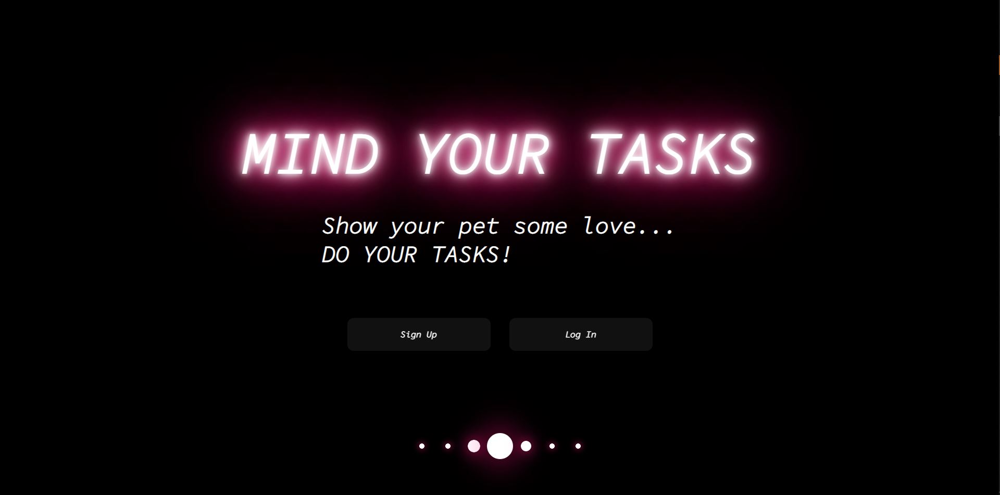
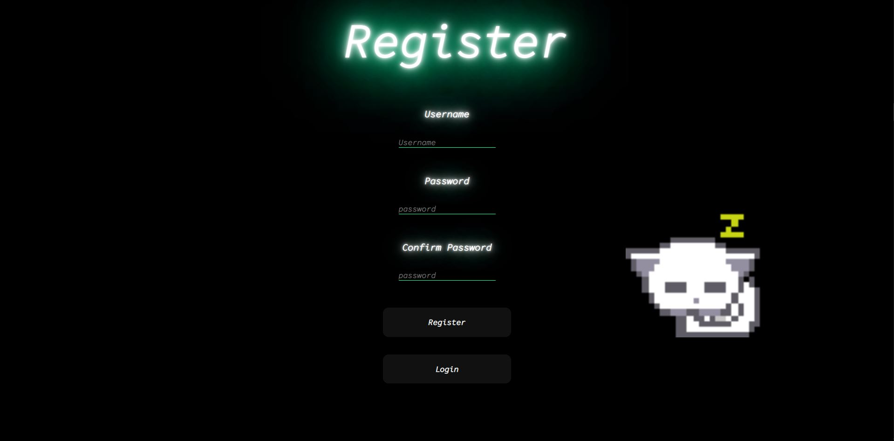

# Mind your Tasks
## What is?
This is web app developed as the final project of the Production Engineering MLH Fellowship. MindYourTask helps you find motivitation to be productive using virtual pets.  
  
You just have to create your account and keep adding task to your "To Do" list, each time you finish a task you will be rewarded with coins you can use to buy food to your pet, and the more tasks you complete, the higher your level will be. Once you reach certain levels, you can choose a new pet.  
  
  
Try it out [here!](https://mindyourtasks.tech)  
## What is using?
For the development and deployment of this app we use:
 - AWS
 - CSS
 - Docker
 - Flask
 - HTML
 - NGINX
 - Python
 - SQLAlchemy
## Run this project local
First you should clone this repository running this command on your computer (if you are new to github and want to learn more about cloning read [here]( https://docs.github.com/en/github/creating-cloning-and-archiving-repositories/cloning-a-repository-from-github/cloning-a-repository) ):  
```console
git clone https://github.com/Buly1601/MindYourTasks.git
```
after cloning you need to be inside of the folder to do the next steps so run:  
```console
cd MindYourTasks
```
You will have to create some .env files to make this project work. Your .env file should have the next syntax:

URL=somerul  
POSTGRES_USER=someuser   
POSTGRES_PASSWORD=somesupersecretpassword  
POSTGRES_HOST=somehostname  
POSTGRES_DB=somedbname  
FLASK_ENV=development 

### Using docker
If you don´t have Docker installed on your computer you will need to download it, to do so please follow the steps in this [link](https://docs.docker.com/get-docker/)  
Once installed you just have to run  
```console
docker-compose up --build
```
the file responsible of this commando is the docker-compose.yml file, so if you want to learn more about what is happening we totally recommend to read this file and the [Compose file documentation](https://docs.docker.com/compose/compose-file/)
Now you just have to go to your webserver and search for **localhost** or the ip addres **127.0.0.1**
### Using flask
To use flask you just need to run the next commands
```console
pip3 install -r requirements.txt
flask run
```
to see the app running go to your web browser and search for **localhost:5000** or **127.0.0.1:5000**
the reason why we add the *:5000* is because our application is running on port 5000 
## Files
### app Folder
 - Files responsable of routing, creating our db models. 
 - Templates folder that contains the HTML files.
 - Static folder that contains the css and assets
### env Folder
Python environment
### .gitignore
Files we don´t want to be upload to this repository
### requirments.txt 
Python libraries necesary for running this app correctly
### docker-compose.yml

# ABOUT US 
| Derya       | Buly        | Gina          |  
|    :----:   |    :----:   |    :----:   |  
|      |       |     |  
| lil bio    | lil bio    | lil bio    |  
